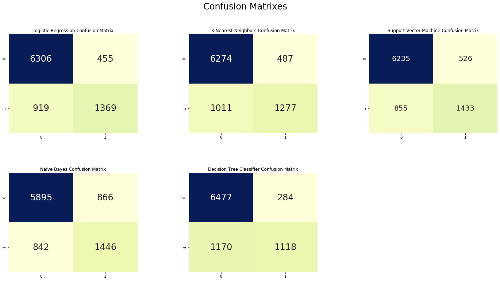

## Welcome to my Portfolio

I am a young, curious and enthusiast person who passion lies in the world of data. I am interested in the intersection between data science, technology and education.  I am passionate about community impact by improving the lives of underrepresented and underprivileged young people so that they can develop skills from their passions and achieve their goals.

## Recent Projects
### [Adult Income Classification](https://github.com/SNWambui/Adult_Income_Classification/blob/master/README.md)

Analyzed census income data and built a classifier to determine whether an adult earns more or less than 50k based on sevar features including their level of education, occupation, workclass among others. 
Optimized Logistic regression, KNN, Random Forests, Decisions Trees and Stochastic Gradient Descent classifiers with kfold cross validation. 
Determined the best classifier to have 84.84% accuracy. Computed confusion matrix to check for misclassification errors for each classifier.

